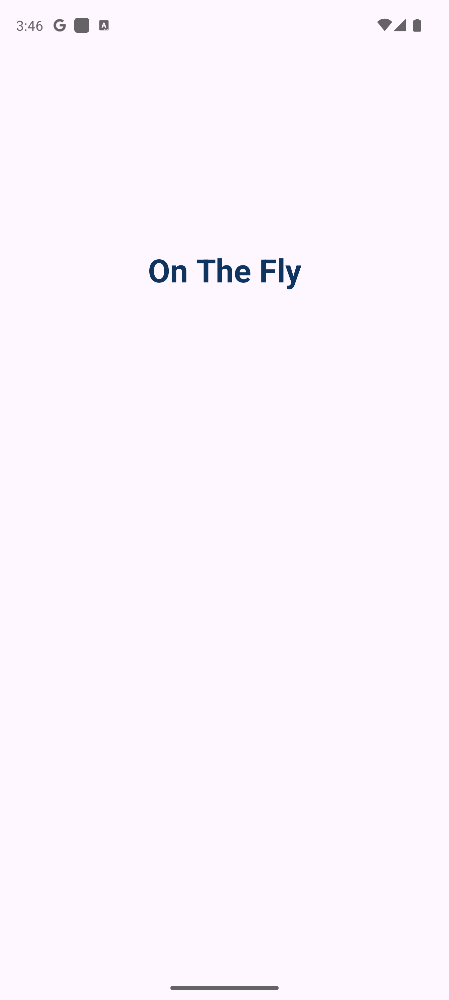
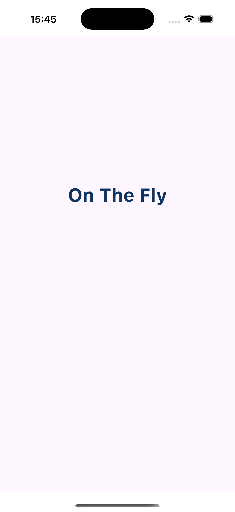
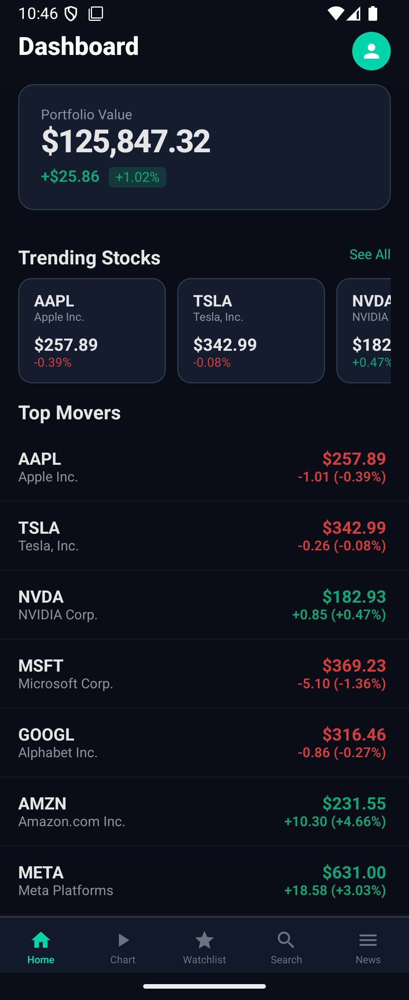
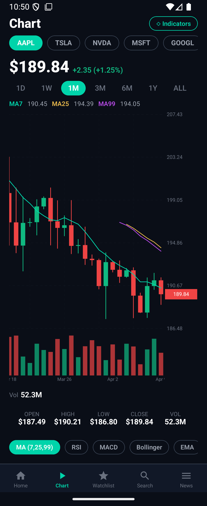
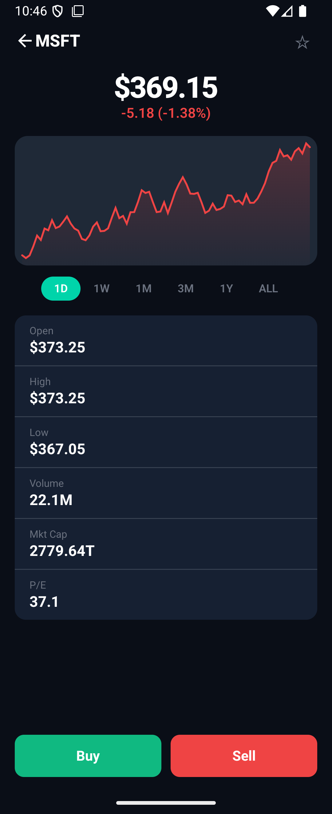
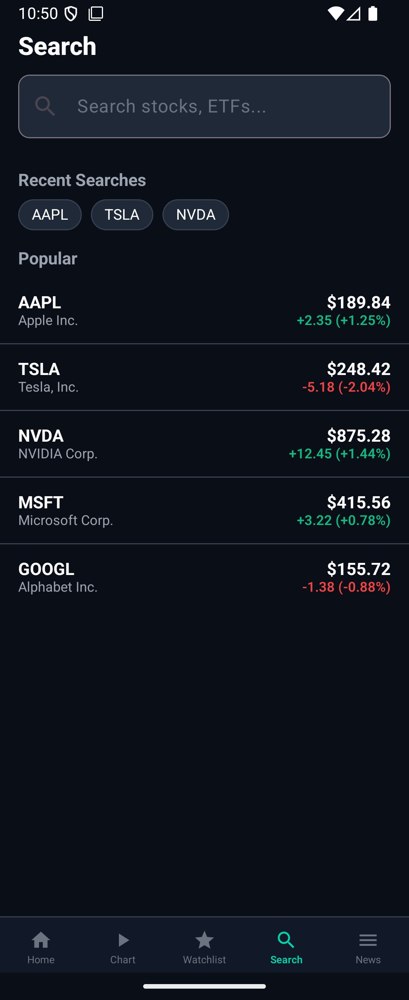

# OnTheFly KMP

**Dynamic UI Engine** for Android, iOS and Desktop — renders native Compose widgets from JavaScript scripts at runtime via the **QuickJS** engine (powered by **Rust** native bridge).

Zero WebView, zero HTML — all UI is native Jetpack Compose / Compose Multiplatform driven entirely by JavaScript.

```
JavaScript defines UI → QuickJS executes (Rust) → UIComponent tree (Kotlin) → Compose renders native → User interactions flow back to JS
```

## Screenshots

### Engine Demo (Basic Components)

| Android | iOS |
|:---:|:---:|
|  |  |
| Pixel 8 Pro (API 34) | iPhone 16 Pro (iOS 18) |

> Same JS bundle, native UI on both platforms — powered by QuickJS engine.

### Stock Trading App Demo

A full-featured stock trading demo app built entirely with OnTheFly JS scripts — no native code per screen. Features real-time price updates via Finnhub WebSocket, candlestick charts with MA indicators, portfolio tracking, search, watchlist, and news feed.

| Dashboard | Candlestick Chart | Stock Detail |
|:---:|:---:|:---:|
|  |  |  |
| Portfolio, trending stocks, top movers | OHLCV candles, MA7/25/99, volume bars | Price, line chart, OHLC stats, buy/sell |

| Search | News |
|:---:|:---:|
|  |  |
| Search stocks, recent & popular | Breaking & latest market news |

**Key highlights:**
- **100% JS-driven** — all 9+ screens are JavaScript bundles, zero platform-specific UI code
- **Real-time data** — Finnhub WebSocket for live price updates with flash animations
- **Candlestick chart** — Custom Canvas renderer with MA lines, volume bars, horizontal scroll, price highlight
- **Cross-screen state** — Shared store for watchlist, user preferences, dark mode
- **i18n** — English & Vietnamese language support
- **Dark/Light theme** — Toggle via shared state, all screens react instantly
- **Settings persistence** — Dark mode and language preferences survive app restarts
- **Splash screen** — Native Compose splash with version check, script extraction, OTA update progress
- **OTA updates** — Production release server simulation for testing zip-based script updates

## Architecture

The project is split into two modules:

| Module | Type | Description |
|---|---|---|
| `onthefly-engine` | KMP Library | Core engine, renderers, viewmodel, data layer — publishable to Maven |
| `composeApp` | Sample App | Demo app that depends on `onthefly-engine` |

```
onthefly-engine (library)          composeApp (sample app)
├── core/     QuickJSEngine        ├── App.kt (NavHost + OnTheFlyScreen)
├── model/    UIComponent, Events  ├── SplashScreen.kt (version check + progress)
├── renderer/ 40+ Compose widgets  ├── MainActivity.kt (Android)
├── viewmodel/ScriptViewModel      ├── Main.kt (Desktop)
├── data/     Storage, Network, WS └── MainViewController.kt (iOS)
├── platform/ PlatformActions (interface)
├── ui/       OnTheFlyScreen (public API)
└── style/    Theme, Dark mode
```

## Tech Stack

| Component | Technology | Version |
|---|---|---|
| Language | Kotlin Multiplatform | 2.1.10 |
| UI | Compose Multiplatform | 1.7.3 |
| Navigation | Compose Navigation | 2.8.0-alpha12 |
| Networking | Ktor Client + WebSockets | 2.3.12 |
| Image Loading | Coil 3 (KMP) | 3.1.0 |
| JS Engine | QuickJS (embedded via Rust bridge) | 2025-09-13 |
| Native Bridge | Rust (cdylib/staticlib) | 2021 edition |
| Lifecycle | AndroidX Lifecycle | 2.8.4 |
| Build | Gradle 8.11.1, AGP 8.7.3 | - |
| Android Min SDK | 24 (Android 7.0) | Target: 36 |
| iOS Min | 16.0 | - |

## Using the Library

### Import

```kotlin
// build.gradle.kts
commonMain.dependencies {
    implementation("com.onthefly:onthefly-engine:1.0.0")
}
```

### Minimal Usage

```kotlin
// Android Activity
val storage = AndroidScriptStorage(this)

setContent {
    App(
        localStorage = storage,
        platformActions = AndroidPlatformActions(this),
        productionServerUrl = null,        // set URL to enable OTA updates
        startScreen = "stock-login",
        appVersion = "1.0.0"
    )
}
```

The `App` composable shows a `SplashScreen` first (version check, script extraction, OTA update), then navigates to the start screen.

```kotlin
// Or use OnTheFlyScreen directly (without splash)
setContent {
    storage.ensureInitialized()
    OnTheFlyScreen(
        bundleName = "my-screen",
        localStorage = storage,
        platformActions = AndroidPlatformActions(this),
        onNavigate = { event -> /* handle navigation */ },
        onGoBack = { finish() }
    )
}
```

### Custom ScriptStorage

```kotlin
class RemoteScriptStorage(private val api: MyApiClient) : ScriptStorage {
    override fun readFile(bundleName: String, fileName: String): String {
        return api.fetchScript("$bundleName/$fileName")
    }
    // ... implement other methods
}
```

### OnTheFlyScreen API

```kotlin
@Composable
fun OnTheFlyScreen(
    bundleName: String,
    localStorage: ScriptStorage,          // interface — bring your own implementation
    platformActions: PlatformActions?,     // interface — optional
    onNavigate: (NavigationEvent) -> Unit, // callback for navigation
    onGoBack: () -> Unit,                  // callback for back
    onToast: (String) -> Unit,             // callback for toast
    viewData: String?,                     // data passed from previous screen
    modifier: Modifier
)
```

## UI Components (40+ types)

### Layout
| Component | Description |
|---|---|
| `Column` | Vertical layout (padding, spacing, alignment, scrollable, border, opacity, gradient, transform, onClick) |
| `Row` | Horizontal layout (spaceBetween, spaceAround, spaceEvenly, scrollable, gradient, transform) |
| `Box` | Stack/overlay container (contentAlignment, gradient, transform, clipToBounds) |
| `Card` | Elevated container with shadow, borderRadius |
| `Spacer` | Fixed width/height spacer |
| `Divider` | Horizontal line separator |
| `LazyColumn` | Virtualized vertical list (pull-to-refresh, infinite scroll, stagger animation) |
| `LazyRow` | Virtualized horizontal list |
| `Grid` | Multi-column grid layout |

### Display
| Component | Description |
|---|---|
| `Text` | Styled text (fontSize, fontWeight, fontStyle, maxLines, textDecoration, lineHeight, selectable, html) |
| `RichText` | Multiple styled spans with click handlers |
| `Image` | Remote image loading via Coil 3 (contentScale, borderRadius, tintColor) |
| `Icon` | Material icons (50+ mapped: home, settings, search, favorite, etc.) |
| `Badge` | Notification dot or count badge |
| `Avatar` | Circular avatar with initials fallback |
| `ProgressBar` | Linear/circular, determinate/indeterminate |

### Input
| Component | Description |
|---|---|
| `Button` | Filled/outlined/text variants, loading spinner, leading icon, disabledColor |
| `IconButton` | Circular icon-only button |
| `TextField` | Label, placeholder, type (text/password/email/number/phone/multiline), error, icons |
| `Toggle` / `Switch` | On/off switch with label |
| `Checkbox` | Checkable with label |
| `RadioGroup` | Radio options (vertical/horizontal) |
| `Dropdown` | Select dropdown with options |
| `SearchBar` | Search input with clear and cancel |
| `Slider` | Continuous/discrete value slider with label |
| `Chip` | Selectable label with icon, close button |

### Navigation
| Component | Description |
|---|---|
| `TopAppBar` | Title, subtitle, navigation icon, action buttons |
| `BottomNavBar` | Bottom navigation with icons, labels, badges |
| `TabBar` | Tab row (fixed or scrollable) with indicator |
| `TabContent` | Animated page switching by selected index |
| `Drawer` | Side panel with header, menu items, scrim overlay |

### Feedback / Overlay
| Component | Description |
|---|---|
| `FullScreenPopup` | Animated overlay (fade/slide/scale) |
| `ConfirmDialog` | Alert dialog with confirm/cancel |
| `BottomSheet` | Slide-up panel with handle, configurable height |
| `Snackbar` | Auto-dismiss message bar with action, top/bottom position |
| `LoadingOverlay` | Full-screen spinner with message |
| `Tooltip` | Tooltip wrapper around child component |

### Advanced
| Component | Description |
|---|---|
| `SwipeToAction` | Swipe to reveal left/right action buttons |
| `WebView` | Web content (placeholder — needs platform SDK) |
| `MapView` | Map display (placeholder — needs platform SDK) |
| `VideoPlayer` | Video playback (placeholder — needs platform SDK) |

### Charts
| Component | Description |
|---|---|
| `CandlestickChart` | OHLCV candlestick chart with MA7/25/99 lines, volume bars, horizontal scroll, price highlight, grid |
| `LineChart` | Simple line chart with gradient fill, auto-scaled Y axis |

## Engine Features

### UI Builder Functions

All JS scripts use concise builder functions (defined in `_base/ui.js`) instead of verbose object literals:

```javascript
// Builder style — concise, with VS Code autocomplete
Column({ alignment: "center", spacing: 8 }, [
    Text({ text: "Hello", fontSize: 28, fontWeight: "bold", color: "#FFF" }),
    Spacer({ height: 12 }),
    Row({ alignment: "spaceBetween" }, [
        Button({ text: "Buy", onClick: "handleBuy", background: "#10B981" }),
        Button({ text: "Sell", onClick: "handleSell", background: "#EF4444" })
    ])
])
```

Name mappings: `Image` → `Img()`, `IconButton` → `IconBtn()`, `FullScreenPopup` → `Popup()`, `LoadingOverlay` → `Loading()`, `ProgressBar` → `Progress()`.

### State Management
```javascript
OnTheFly.state("count", 0);
OnTheFly.setState("count", OnTheFly.getState("count") + 1);

// Auto-binding in UI
Text({ text: "Count: $state.count" })

// Computed values
OnTheFly.computed("total", function() { return getState("price") * getState("qty"); });

// Global store (cross-screen) + persistent storage
OnTheFly.store.set("user", { name: "Dong" });
OnTheFly.sendToNative("setStorage", { key: "token", value: "abc" });

// Settings persistence (survives app restarts)
// Dark mode and language are auto-restored on startup via restorePersistedPreferences()
AppState.setDarkMode(true);        // persists to native storage
StockI18n.setLang("vi");           // persists to native storage
```

### WebSocket / Realtime
```javascript
OnTheFly.connectWS("wss://echo.websocket.org", {
    id: "chat", autoReconnect: true, maxReconnectAttempts: 5
});
OnTheFly.sendWS("Hello!", "chat");
OnTheFly.closeWS("chat");

function onRealtimeData(data) {
    // data = { id: "chat", message: "...", type: "text" }
}
function onWSConnected(data) { /* { id: "chat" } */ }
function onWSDisconnected(data) { /* { id, code, reason } */ }
```

### Form Validation
```javascript
var result = OnTheFly.validateForm({
    "emailField": {
        value: formData.email,
        rules: [
            { type: "required", message: "Email is required" },
            { type: "email", message: "Invalid email" }
        ]
    },
    "passwordField": {
        value: formData.password,
        rules: [
            { type: "required" },
            { type: "minLength", value: 8 }
        ]
    }
});
if (result._valid) { /* submit */ }
```

### Multi-Language (i18n)
```javascript
OnTheFly.setLocale("vi");
OnTheFly.t("greeting", { name: "Dong" }); // "Xin chao, Dong!"

// Auto-binding
Text({ text: "$lang.welcome_back" })
```

### Animation System
```javascript
Card({
    enterAnimation: { type: "slideInUp", duration: 300, easing: "spring" },
    exitAnimation: { type: "fadeOut", duration: 200 }
}, [...])

// Types: fadeIn/Out, slideIn/OutLeft/Right/Up/Down, scaleIn/Out
// Easing: linear, easeIn, easeOut, easeInOut, spring
```

### Error Handling
```javascript
function onError(error) {
  // error = { type: "js_error"|"network_error"|"timeout_error", message, code, details }
}
```
- Auto-retry on script load failures (configurable `maxRetries`)
- Network requests: retry with exponential backoff, timeout, cancellation

### Security
- **Script signature verification** (SHA-256 per-file + bundle hash)
- **Domain whitelist** for outbound requests (HTTP + WebSocket)
- **HTTPS enforcement** (configurable)
- **Rate limiting** (max requests per minute)

### Platform Integration
```javascript
OnTheFly.sendToNative("openUrl", { url: "https://example.com" });
OnTheFly.sendToNative("copyToClipboard", { text: "Hello" });
OnTheFly.sendToNative("share", { title: "Check this", text: "...", url: "..." });
OnTheFly.sendToNative("getDeviceInfo", {});
OnTheFly.sendToNative("vibrate", { type: "success" });
OnTheFly.sendToNative("showSnackbar", { message: "Saved!", actionText: "Undo" });
OnTheFly.sendToNative("showPopup", { title: "Confirm", message: "Delete?", confirmText: "Yes" });
OnTheFly.sendToNative("setStatusBar", { color: "#1A1A2E", darkIcons: true });
OnTheFly.sendToNative("keepScreenOn", { enabled: true });
OnTheFly.sendToNative("setOrientation", { orientation: "landscape" });
```

### Dark Mode & Custom Components
```javascript
OnTheFly.registerStyles({ title: { color: "#FFF" } }, "dark");
OnTheFly.setTheme("dark");

OnTheFly.registerComponent("UserCard", function(props) {
  return Card({}, [
    Avatar({ name: props.name }),
    Text({ text: props.name })
  ]);
});
```

### Debug & Versioning
```javascript
OnTheFly.debug.showConsole(true);
OnTheFly.debug.enableInspector(true);
OnTheFly.getBundleInfo();    // { name: "home", version: "2.1.0" }
OnTheFly.getEngineVersion(); // "1.0.0"
```

## Project Structure

```
OnTheFly-KMP/
├── onthefly-engine/                    KMP LIBRARY (publishable)
│   ├── build.gradle.kts                android-library + KMP + maven-publish
│   └── src/
│       ├── commonMain/kotlin/com/onthefly/engine/
│       │   ├── core/                   QuickJSEngine, QuickJSBridge (expect)
│       │   ├── model/                  UIComponent, EngineEvent, NativeAction
│       │   ├── data/                   ScriptStorage (interface), Repository, Network, WebSocket
│       │   ├── renderer/              11 renderer files (40+ components)
│       │   ├── viewmodel/            ScriptViewModel, ScriptViewModelFactory
│       │   ├── ui/                   OnTheFlyScreen (public composable API)
│       │   ├── style/                ComponentStyle, StyleRegistry
│       │   ├── security/             SecurityConfig, ScriptVerifier
│       │   ├── error/                EngineError, ErrorConfig
│       │   ├── version/              VersionManager
│       │   ├── debug/                DebugConfig
│       │   ├── navigation/           ViewDataStore
│       │   ├── platform/             PlatformActions (interface)
│       │   └── util/                 JsonParser
│       ├── commonTest/               Unit tests (VersionManager, Security, Error, JsonParser)
│       ├── androidMain/              JNI bridge, AndroidScriptStorage, AndroidPlatformActions
│       │   └── cpp/                  QuickJS C source + bridge
│       ├── iosMain/                  cinterop bridge, IosScriptStorage, IosPlatformActions
│       └── desktopMain/              JNI bridge, DesktopScriptStorage, DesktopPlatformActions
│
├── composeApp/                         SAMPLE APP
│   ├── build.gradle.kts                depends on :onthefly-engine
│   └── src/
│       ├── commonMain/                 App.kt (NavHost), SplashScreen.kt (init + progress)
│       ├── androidMain/                MainActivity.kt
│       ├── iosMain/                    MainViewController.kt
│       └── desktopMain/                Main.kt
│
├── native/                             Rust QuickJS bridge (+ legacy C/C++)
│   └── rust/                           Cargo workspace: engine.rs, jni_bridge.rs, ios_bridge.rs
├── devserver/                          Dev server + JS script bundles
│   ├── scripts/
│   │   ├── _base/                      ui.js (builder functions), utils.js (helpers)
│   │   ├── _libs/                      appState, stockTheme, stockI18n, stockData, etc.
│   │   ├── _modules/                   ES modules (import/export, loaded on demand)
│   │   ├── languages/                  i18n (en.json, vi.json)
│   │   └── screens/                    home, demo-app, api-demo, websocket-demo,
│   │                                   stock-dashboard, stock-chart, stock-detail,
│   │                                   stock-search, stock-watchlist, stock-news, etc.
│   ├── types/                          TypeScript declarations for VS Code autocomplete
│   │   └── onthefly.d.ts               Type definitions for all APIs + components
│   ├── jsconfig.json                   VS Code configuration for IntelliSense
│   └── server.py                       HTTP + WebSocket push + file watcher + release server
└── iosApp/                             Xcode project wrapper
```

## Bidirectional Event System

### Native → JS (30+ events)

| Category | Events |
|---|---|
| Lifecycle | `onCreateView`, `onResume`, `onPause`, `onDestroy`, `onVisible`, `onInvisible` |
| Data | `onDataReceived`, `onViewData`, `onRealtimeData` |
| WebSocket | `onWSConnected`, `onWSDisconnected`, `onWSError` |
| Input | `onClick`, `onToggle`, `onTextChanged`, `onSubmit`, `onCheckChanged`, `onRadioChanged`, `onSliderChanged`, `onDropdownChanged` |
| List | `onRefresh`, `onEndReached`, `onTabChanged` |
| Error | `onError` (js_error, network_error, timeout_error, websocket_error) |

### JS → Native (35+ actions)

| Category | Actions |
|---|---|
| Navigation | `navigate`, `goBack`, `navigateDelayed`, `navigateReplace`, `navigateClearStack` |
| Network | `sendRequest` (retry, timeout), `cancelRequest` |
| WebSocket | `connectWebSocket`, `sendWebSocket`, `closeWebSocket` |
| UI | `showToast`, `showSnackbar`, `showPopup`, `hideKeyboard`, `setFocus`, `scrollTo` |
| Storage | `setStorage`, `getStorage`, `removeStorage` |
| Platform | `openUrl`, `copyToClipboard`, `share`, `getDeviceInfo`, `vibrate`, `setStatusBar`, `setScreenBrightness`, `keepScreenOn`, `setOrientation` |

## Interfaces (Public API)

| Interface | Built-in Implementations | Purpose |
|---|---|---|
| `ScriptStorage` | `AndroidScriptStorage`, `IosScriptStorage`, `DesktopScriptStorage` | Script file I/O + key-value storage + zip extraction + OTA updates |
| `PlatformActions` | `AndroidPlatformActions`, `IosPlatformActions`, `DesktopPlatformActions` | Platform-specific actions (URL, clipboard, vibration, etc.) |

## Build & Run

### Prerequisites

- JDK 17+
- Android SDK (API 36) + NDK 27.0.12077973 + CMake 3.22.1
- Xcode 15+ (for iOS)

### Android

```bash
./gradlew :composeApp:assembleDebug
```

### Desktop

```bash
cd native/rust && ./build_desktop.sh  # one-time (builds Rust native lib)
./gradlew :composeApp:run
```

### iOS

```bash
cd native/rust && ./build_ios.sh  # one-time (builds Rust static lib for arm64/x86_64/sim)
# Open iosApp/iosApp.xcodeproj in Xcode
```

### Android Native (Rust)

```bash
cd native/rust && ./build_android.sh  # builds .so for arm64-v8a, armeabi-v7a, x86_64
# Output: onthefly-engine/src/androidMain/jniLibs/
```

### Tests

```bash
./gradlew :onthefly-engine:desktopTest
```

### Publish Library

```bash
./gradlew :onthefly-engine:publishToMavenLocal
```

## Hot Reload (Dev Server)

```bash
cd devserver
pip install watchdog websockets  # optional
python server.py
# HTTP on port 8080, WebSocket push on port 8081, Release server on port 8082
# Edit JS → save → auto-validate → push to devices
```

| Command | Description |
|---|---|
| `s` / `status` | Server status + connected devices |
| `c` / `clients` | List connected devices with details |
| `v [bundle]` | Validate JS syntax |
| `d [bundle]` | Deploy scripts to Android assets |
| `r` / `reload` | Force reload all devices |
| `ra` / `run android` | Launch Android emulator build |
| `rd` / `run desktop` | Launch desktop app |
| `br` / `build-release` | Build release zip + version.json to `releases/` |
| `rs` / `release-server` | Start release server only (port 8082) |

### Release Server (OTA Simulation)

The dev server auto-starts a release server on port 8082 for testing production OTA updates:

```bash
python server.py build-release   # Build releases/scripts.zip + releases/version.json
```

| Endpoint | Description |
|---|---|
| `GET /api/version` | Returns `{ "version": "x.y.z" }` (max version from all bundles) |
| `GET /api/download` | Downloads `scripts.zip` binary |

Set `productionServerUrl = "http://10.0.2.2:8082"` in `MainActivity.kt` to test OTA on Android emulator.

## Migrated From

This project was migrated from [OnTheFly-Android](https://github.com/dongnh311/OnTheFly-Android) (single-platform Android) to Kotlin Multiplatform, retaining 100% of the logic and JS bundles while adding iOS and Desktop support.

The native bridge was migrated from C/C++ to **Rust**, providing per-context thread-safe state management, unified codebase across all 3 platforms, and compiler-enforced memory safety.
